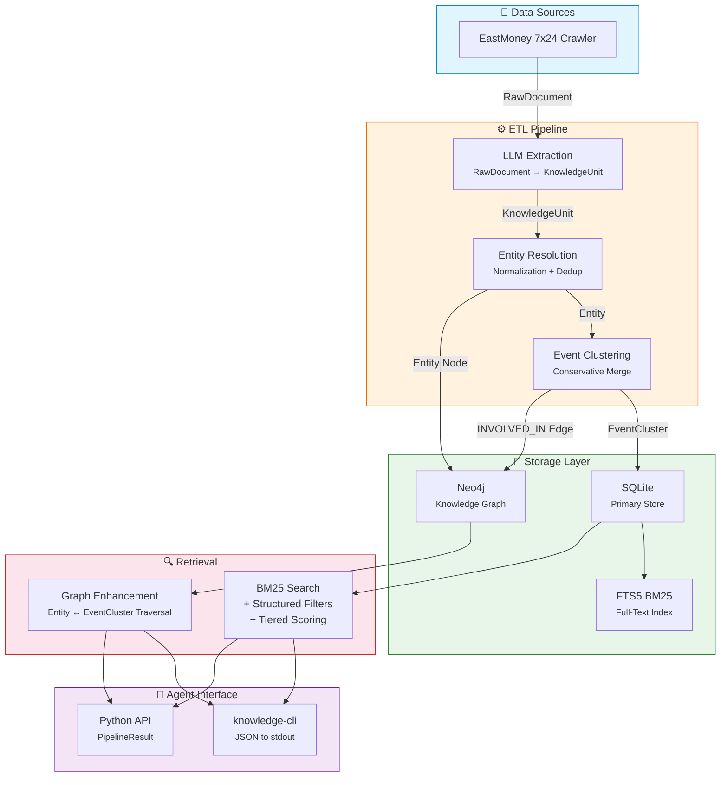
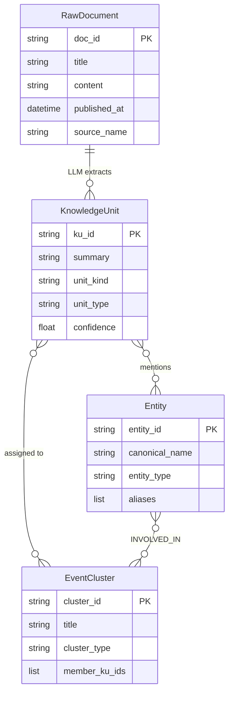

<h1 align="center">Financial Knowledge Retrieval Foundation</h1>

<p align="center">
  <strong>将原始金融新闻转化为可检索、可溯源、可组合的知识图谱</strong>
</p>

<p align="center">
  
  
  
  
  
</p>

<p align="center">
  <em>Transform raw financial news into searchable, traceable, composable knowledge — for AI agents.</em>
</p>

---

## Architecture



---

## Key Features

|     | Feature | Description |
| --- | ------- | ----------- |
| 📝 | **Statement-Level Extraction** | LLM 从每篇新闻中抽取原子级事实（KnowledgeUnit），而非整篇文档。每条证据保留原文溯源 |
| 🔍 | **BM25 + Graph Hybrid Retrieval** | FTS5 全文检索 + Neo4j 图谱遍历并行召回，分层打分：实体匹配(5x) > 类型匹配(2x) > 文本相关性 > 时效 |
| 🧩 | **Conservative Clustering** | 仅当实体一致、事件类型相同、时间邻近、语义相似时才合并事件，避免过度聚合导致的幻觉 |
| 🤖 | **Agent-Native CLI** | `knowledge-cli` 输出结构化 JSON，专为 AI agent 程序化消费设计 |
| 🛡️ | **End-to-End Typed Pipeline** | Pydantic v2 模型贯穿全栈：从数据抽取到检索输出，100 项测试 + 0 类型错误 |

---

## Quick Start

### 1. Install Dependencies

```bash
# Requires Python 3.13+ and uv
uv sync
```

### 2. Configure Environment

```bash
cp .env.example .env
# Edit .env: set ANTHROPIC_API_KEY (required) and NEO4J_PASSWORD
```

### 3. Ingest & Search

```bash
# Ingest news into knowledge base
uv run knowledge-cli ingest --graph-enabled

# Search for knowledge about an entity
uv run knowledge-cli search --entities "小米集团" --time-range 2025-04-01:2026-04-13
```

### Docker (Alternative)

```bash
docker compose up -d                    # Start app + Neo4j
docker compose exec app knowledge-cli search --entities "小米集团"
```

---

## Data Model



| Layer         | Storage                                        | Purpose |
| ------------- | ---------------------------------------------- | ------- |
| RawDocument | SQLite `news_articles` | 原始新闻文章 |
| KnowledgeUnit | SQLite `knowledge_units` + FTS5 index | 最小可检索单元（statement-level） |
| Entity | SQLite `entities` + Neo4j `Entity` nodes | 标准化实体（Company / Person / Org） |
| EventCluster | SQLite `event_clusters` + Neo4j `EventCluster` nodes | 保守聚合的事件簇 |

---

## Usage

### CLI

```bash
# Search with filters
knowledge-cli search \
  --entities "小米集团" "腾讯控股" \
  --time-range 2025-04-01:2026-04-13 \
  --event-types "债务违约" "股权质押" \
  --intent ENTITY_OVERVIEW \
  --top-k 20 \
  --hops 2

# Relationship query (A→B path)
knowledge-cli search \
  --entities "小米集团" \
  --target-entity "美的集团" \
  --intent RELATIONSHIP_QUERY

# Ingest news
knowledge-cli ingest --batch-size 10 --graph-enabled

# Service management (daemonized fetch + offline)
knowledge-cli start --graph-enabled
knowledge-cli status
knowledge-cli stop
```

### Python API

```python
from src.orchestration import run_pipeline
from src.schemas.query import make_query

result = run_pipeline(
    structured_query=make_query(
        entities=["小米集团"],
        time_range=("2025-04-01", "2026-04-13"),
    ),
    graph_enabled=True,
    top_k=20,
)

print(result.to_dict())
```

---

## Scoring

检索采用分层打分策略，确保最相关的知识排在前面：

| Score Component | Weight      | Logic |
| --------------- | ----------- | ----- |
| Entity Match | 5.0x | 查询实体命中 KnowledgeUnit 关联实体 |
| Event Type Match | 2.0x | 查询事件类型命中 unit_type |
| BM25 Text Score | 1.0x | FTS5 全文相关性 |
| Recency | tie-breaker | 微小时间衰减因子 |

---

## Project Structure

```text
news/
├── collectors/              # EastMoney news crawler + database layer
├── src/
│   ├── cli.py               # knowledge-cli entry point
│   ├── knowledge_base.py    # RawDocument + KnowledgeUnit models + SQLite repos
│   ├── entities.py          # Entity resolution + EntityRepository
│   ├── event_clustering.py  # EventCluster conservative merge
│   ├── knowledge_extractor.py  # LLM-based KnowledgeUnit extraction
│   ├── time_normalization.py   # Relative/fuzzy time → absolute
│   ├── conflict_detection.py   # Multi-source conflict analysis
│   ├── entity_context_filter.py # LLM extraction entity context injection
│   ├── retrieval/           # BM25 + FTS5 search layer
│   ├── graph/               # Neo4j connection + graph retrieval
│   ├── orchestration/       # Pipeline orchestrator + PipelineResult
│   ├── schemas/             # StructuredQuery, IntentType
│   ├── pipeline/            # Continuous ingestion pipeline
│   └── llm/                 # LLM client configuration
├── tests/                   # 100 tests, 0 type errors
├── docs/                    # Architecture docs + shared rules
├── Dockerfile               # Multi-stage build
├── docker-compose.yml       # App + Neo4j orchestration
└── pyproject.toml           # Dependencies + CLI entry point
```

---

## Development

```bash
uv sync --group dev     # Install dev dependencies
uv run pytest           # Run tests (100 passed)
uv run pyright .        # Type check (0 errors)
```

---

## Documentation

- [PROGRESS.md](PROGRESS.md) — Development progress & migration history
- [docs/SHARED_RULES.md](docs/SHARED_RULES.md) — Project authority & guardrails
- [CLAUDE.md](CLAUDE.md) — Claude Code entry point

---

## License

Private repository. All rights reserved.
