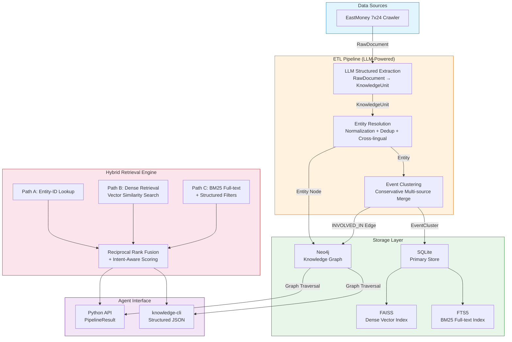
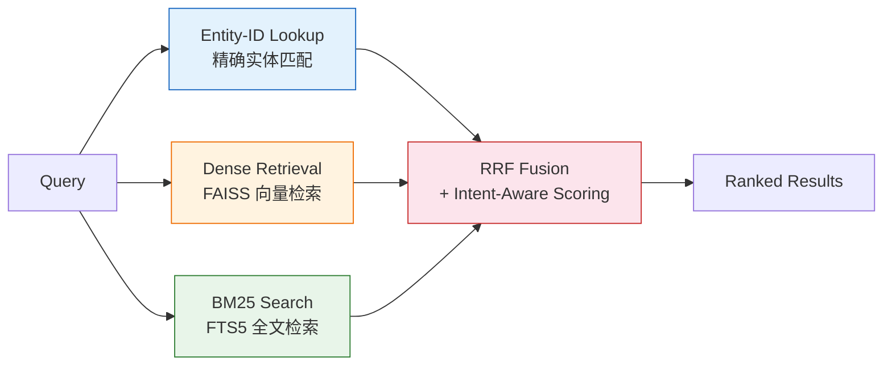
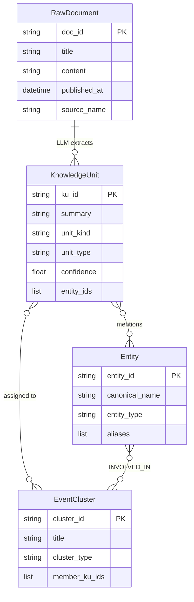

<h1 align="center">Financial Knowledge Retrieval Foundation</h1>

<p align="center">
  <strong>将原始金融新闻转化为可检索、可溯源、可组合的知识图谱</strong><br/>
  <sub>面向 AI Agent 的金融知识检索底座 — Hybrid Retrieval + GraphRAG + LLM Structured Extraction</sub>
</p>

<p align="center">
  
  
  
  
  
  
  
</p>

<p align="center">
  <em>Transform raw financial news into searchable, traceable, composable knowledge — for AI agents.</em>
</p>

---

## Why This Exists

金融信息散落在新闻、公告、研报等多个渠道，AI Agent 无法直接消费原始文本。本项目将原始消息加工为 **结构化、可溯源、可检索的知识层**，让 Agent 能像查询数据库一样精准检索金融事件、实体关系和时间线。

**核心价值**：不是又一个搜索引擎，而是一个让 AI Agent 拥有"金融记忆"的知识底座。

---

## Architecture



---

## Key Highlights

| Feature | What It Does | Why It Matters |
| --- | --- | --- |
| **Hybrid Retrieval** | 三条检索路径并行：Entity-ID 精确查找 + Dense 向量语义检索 + BM25 全文匹配，Reciprocal Rank Fusion 融合排序 | 兼顾精确召回与语义理解，不同查询意图走最优路径 |
| **Dense Vector Search** | FAISS IndexFlatIP + OpenAI-compatible Embedding API，余弦相似度检索 | 支持语义级模糊查询，捕获 BM25 无法覆盖的同义/近义表达 |
| **GraphRAG** | Neo4j 实体-事件图谱，支持 1-hop/2-hop 遍历与关系路径发现 | 从"找文章"升级为"找关系"，发现隐含关联 |
| **Statement-Level Extraction** | LLM 从每篇新闻中抽取原子级事实（KnowledgeUnit），而非整篇文档 | 精准溯源，避免整篇文档噪声 |
| **Conservative Clustering** | 仅当实体一致、事件类型相同、时间邻近、语义相似时才合并 | 避免过度聚合导致的信息幻觉 |
| **Intent-Aware Scoring** | 不同意图（概览/风险评估/事件影响/主题研究）使用独立权重配置 | 同一实体，不同查询目的得到最优排序 |
| **Agent-Native CLI** | `knowledge-cli` 输出结构化 JSON，专为 AI agent 程序化消费设计 | Agent 可直接调用，零适配成本 |

---

## Tech Stack

| Layer | Technology | Purpose |
| --- | --- | --- |
| **LLM Extraction** | Anthropic Claude | 结构化知识抽取 (RawDocument → KnowledgeUnit) |
| **Embedding** | OpenAI-compatible API (`text-embedding-3-small`) | 语义向量化，支持任意兼容 API |
| **Vector DB** | FAISS (IndexFlatIP) | Dense 向量索引，inner product = cosine similarity |
| **Full-text Search** | SQLite FTS5 | BM25 全文索引，中文分词 (jieba) |
| **Knowledge Graph** | Neo4j | 实体-事件关系图谱，多跳遍历 |
| **Primary Store** | SQLite | 文档、知识单元、实体、事件簇存储 |
| **Type Safety** | Pydantic v2 + Pyright | 全栈类型安全，188+ 测试 0 类型错误 |
| **Runtime** | Python 3.13+, uv | 现代 Python 工具链 |

---

## Quick Start

### 1. Install

```bash
# Requires Python 3.13+ and uv
git clone <repo-url> && cd news
uv sync
```

### 2. Configure

```bash
cp .env.example .env
# Required: ANTHROPIC_API_KEY
# Optional: NEO4J_PASSWORD, OPENAI_EMBEDDING_API_KEY, OPENAI_EMBEDDING_BASE_URL
```

### 3. Ingest & Search

```bash
# Ingest news into knowledge base (with graph sync)
uv run knowledge-cli ingest --graph-enabled

# Build vector index (optional, enables dense retrieval)
uv run knowledge-cli index-vectors

# Search for knowledge
uv run knowledge-cli search --entities "小米集团" --time-range 2025-04-01:2026-04-13
```

### Docker

```bash
docker compose up -d                    # Start app + Neo4j
docker compose exec app knowledge-cli search --entities "小米集团"
```

---

## Retrieval Engine

### Three-Path Hybrid Retrieval



| Path | Method | Best For | Weight |
| --- | --- | --- | --- |
| **Entity-ID** | JSON column lookup on `entity_ids` | 精确实体查询 | Entity bonus: 6-10x |
| **Dense** | FAISS inner product (top-60) | 语义模糊查询、主题研究 | Dense weight: 6-8x |
| **BM25** | SQLite FTS5 + jieba 分词 | 关键词精确匹配 | BM25 weight: 0.5-0.8x |

### Intent-Aware Scoring Profiles

每个查询意图有独立的权重配置，确保最优排序：

| Intent | Dense | Entity | Event Type | Special |
| --- | --- | --- | --- | --- |
| `ENTITY_OVERVIEW` | 8.0x | 10.0x | 3.0x | - |
| `RISK_ASSESSMENT` | 6.0x | 8.0x | 5.0x | Risk type +5.0x |
| `EVENT_IMPACT_ANALYSIS` | 6.0x | 7.0x | 4.0x | Causal chain +4.0x |
| `TOPIC_RESEARCH` | 8.0x | 6.0x | 3.0x | Recency boost |
| `COMPARATIVE_ANALYSIS` | 7.0x | 9.0x | 4.0x | Coverage bonus |

### Graceful Degradation

系统在任何检索组件不可用时自动降级，不会中断服务：

- **无 Embedding API** → 跳过 Dense 路径，BM25 + Entity-ID 仍可用
- **向量索引为空** → 提示运行 `knowledge-cli index-vectors` 构建
- **Neo4j 不可用** → Graph 增强跳过，核心检索不受影响

---

## Data Model



| Layer | Storage | Index | Purpose |
| --- | --- | --- | --- |
| RawDocument | SQLite `news_articles` | - | 原始新闻文章 |
| KnowledgeUnit | SQLite `knowledge_units` | FTS5 + FAISS | 最小可检索单元 (statement-level) |
| Entity | SQLite `entities` + Neo4j | - | 标准化实体 (Company / Person / Org) |
| EventCluster | SQLite `event_clusters` + Neo4j | - | 保守聚合的事件簇 |

---

## Usage

### CLI

```bash
# Entity overview
knowledge-cli search --entities "小米集团" --intent ENTITY_OVERVIEW --top-k 20

# Comparative analysis (multi-entity)
knowledge-cli search --entities "小米集团" "腾讯控股" --intent COMPARATIVE_ANALYSIS

# Relationship query (A→B path via graph)
knowledge-cli search --entities "小米集团" --target-entity "美的集团" --intent RELATIONSHIP_QUERY

# Event impact analysis
knowledge-cli search --entities "小米集团" --event-types "债务违约" --intent EVENT_IMPACT_ANALYSIS

# Ingest news
knowledge-cli ingest --batch-size 10 --graph-enabled

# Build / rebuild vector index
knowledge-cli index-vectors
knowledge-cli index-vectors --rebuild

# Service management
knowledge-cli start --graph-enabled
knowledge-cli status
knowledge-cli stop
```

### Python API

```python
from src.orchestration import run_pipeline
from src.schemas.query import make_query

result = run_pipeline(
    structured_query=make_query(
        entities=["小米集团"],
        time_range=("2025-04-01", "2026-04-13"),
    ),
    graph_enabled=True,
    top_k=20,
)

print(result.to_dict())
```

---

## Project Structure

```text
news/
├── collectors/                  # EastMoney news crawler + database layer
├── src/
│   ├── cli.py                   # knowledge-cli entry point
│   ├── knowledge_base.py        # RawDocument + KnowledgeUnit models + SQLite repos
│   ├── entities.py              # Entity resolution + EntityRepository
│   ├── event_merging.py        # EventCluster conservative merge
│   ├── knowledge_extractor.py   # LLM-based KnowledgeUnit extraction (Anthropic)
│   ├── time_normalization.py    # Relative/fuzzy time → absolute
│   ├── conflict_detection.py    # Multi-source conflict analysis
│   ├── entity_context_filter.py # LLM extraction entity context injection
│   ├── retrieval/               # Hybrid retrieval engine
│   │   ├── knowledge_search.py  #   Multi-path search orchestration
│   │   ├── vector_index.py      #   FAISS dense vector index
│   │   ├── embedding.py         #   OpenAI-compatible embedding provider
│   │   ├── scoring.py           #   Intent-aware scoring profiles
│   │   └── indexing.py          #   Index building utilities
│   ├── graph/                   # Neo4j connection + graph retrieval
│   ├── orchestration/           # Pipeline orchestrator + PipelineResult
│   ├── schemas/                 # StructuredQuery, IntentType
│   ├── pipeline/                # Continuous ingestion pipeline
│   └── llm/                     # LLM client configuration
├── tests/                       # 147+ tests, 0 type errors
├── Dockerfile                   # Multi-stage build
├── docker-compose.yml           # App + Neo4j orchestration
└── pyproject.toml               # Dependencies + CLI entry point
```

---

## Development

```bash
uv sync --group dev     # Install dev dependencies
uv run pytest           # Run tests (147+ passed)
uv run pyright .        # Type check (0 errors)
```

---

## Documentation

- [docs/SHARED_RULES.md](docs/SHARED_RULES.md) — Project authority & guardrails
- [CLAUDE.md](CLAUDE.md) — Claude Code entry point

---

## License

Private repository. All rights reserved.
