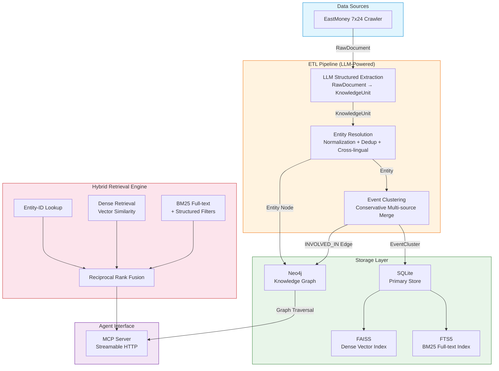
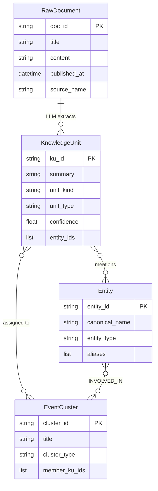

<h1 align="center">Financial Knowledge Retrieval Foundation</h1>

<p align="center">
  <strong>将原始金融新闻转化为可检索、可溯源、可组合的知识图谱</strong><br/>
  <sub>面向 AI Agent 的金融知识检索底座 — MCP Server + Hybrid Retrieval + GraphRAG</sub>
</p>

<p align="center">
  
  
  
  
  
  
</p>

<p align="center">
  <em>Transform raw financial news into searchable, traceable, composable knowledge — for AI agents.</em>
</p>

---

## Why This Exists

金融信息散落在新闻、公告、研报等多个渠道，AI Agent 无法直接消费原始文本。本项目将原始消息加工为 **结构化、可溯源、可检索的知识层**，通过 MCP (Model Context Protocol) 协议对外暴露，让 AI Agent 能像查询数据库一样精准检索金融事件、实体关系和时间线。

**核心价值**：不是又一个搜索引擎，而是一个让 AI Agent 拥有"金融记忆"的知识底座。

---

## Quick Start — 接入 MCP 服务

项目以 MCP Server 形式提供服务，任何支持 MCP 协议的 AI Agent 均可直接接入。

### 服务地址

```
https://182-61-1-77.nip.io/mcp
```

协议：**Streamable HTTP**（MCP 2024-11-05），无需 API Key。

### Claude Code 接入

在 Claude Code 配置中添加 MCP server：

```json
{
  "mcpServers": {
    "knowledge": {
      "type": "url",
      "url": "https://182-61-1-77.nip.io/mcp"
    }
  }
}
```

### 可用工具

| 工具 | 用途 |
|------|------|
| `search_knowledge` | 检索实体、事件和关系。返回知识单元、实体画像、事件聚类和图谱概览 |
| `expand_graph_detail` | 展开图谱聚类的完整节点/边/路径详情 |

### 工具调用示例

**search_knowledge** — 查公司概况：

```json
{
  "entities": ["小米集团"],
  "intent": "ENTITY_OVERVIEW",
  "time_range": "2025-04-01:2026-05-26",
  "top_k": 20
}
```

**search_knowledge** — 查两公司关系：

```json
{
  "entities": ["比亚迪"],
  "target_entity": "特斯拉",
  "intent": "RELATIONSHIP_QUERY",
  "hops": 2
}
```

**search_knowledge** — 查特定事件类型：

```json
{
  "entities": ["宁德时代"],
  "intent": "EVENT_ANALYSIS",
  "event_types": ["企业并购/重组", "供应链中断/调整"]
}
```

**expand_graph_detail** — 展开图谱详情：

```json
{
  "cluster_ids": ["cluster_abc123"]
}
```

> `cluster_ids` 必须来自 `search_knowledge` 返回的 `graph_data.clusters_overview[].cluster_id`。

### 查询意图一览

| Intent | 适用场景 |
|--------|---------|
| `ENTITY_OVERVIEW` | 查公司/人物概况与最新动态（默认） |
| `ENTITY_TIMELINE` | 按时间线梳理实体事件 |
| `RELATIONSHIP_QUERY` | 查两个实体间关系路径（需配合 `target_entity`） |
| `COMPARATIVE_ANALYSIS` | 多实体对比分析 |
| `EVENT_ANALYSIS` | 按事件类型筛选 |
| `RISK_ASSESSMENT` | 风险因素评估 |
| `EVENT_IMPACT_ANALYSIS` | 事件影响范围分析 |
| `TOPIC_RESEARCH` | 主题/产业链研究 |
| `GUARANTEE_ANALYSIS` | 担保关系分析 |

### 注意事项

- 实体名称必须使用中文（如「比亚迪」「宁德时代」），不支持英文简称
- 知识库主要覆盖中国 A 股和港股上市公司、主要金融机构及宏观经济实体
- 实体不在知识库中时返回空结果（不报错）
- 单次 `search_knowledge` 最多返回 `top_k` 条（上限 100）

### 服务限制

当前服务器为个人低配实例（**2Mbps 带宽 / 4GB 内存**），使用时请注意：

- **响应较慢**：首次调用可能需 5-15 秒，冷启动和带宽瓶颈是主要原因
- **并发能力有限**：不建议多客户端同时高频调用，容易出现超时
- **数据增量更新**：知识库通过离线管线持续更新，非实时数据
- **可用性不保证**：个人服务器，无 SLA，可能因维护或网络原因暂时不可用

如有频繁使用需求，建议自行部署（参考下方 Development → Docker）。

---

## Architecture



---

## Data Model



| Layer | Storage | Index | Purpose |
| --- | --- | --- | --- |
| RawDocument | SQLite `news_articles` | - | 原始新闻文章 |
| KnowledgeUnit | SQLite `knowledge_units` | FTS5 + FAISS | 最小可检索单元 (statement-level) |
| Entity | SQLite `entities` + Neo4j | - | 标准化实体 (Company / Person / Org) |
| EventCluster | SQLite `event_clusters` + Neo4j | - | 保守聚合的事件簇 |

---

## Tech Stack

| Layer | Technology | Purpose |
| --- | --- | --- |
| **Agent Protocol** | MCP (Streamable HTTP) | AI Agent 标准化接入 |
| **LLM Extraction** | Anthropic Claude | 结构化知识抽取 |
| **Embedding** | OpenAI-compatible API | 语义向量化 |
| **Vector DB** | FAISS (IndexFlatIP) | Dense 向量索引 |
| **Full-text Search** | SQLite FTS5 + jieba | BM25 全文索引 |
| **Knowledge Graph** | Neo4j | 实体-事件关系图谱 |
| **Primary Store** | SQLite | 文档、知识单元、实体、事件簇存储 |
| **Runtime** | Python 3.13+, uv, Docker | 现代 Python 工具链 |

---

## Project Structure

```text
news/
├── collectors/                  # EastMoney news crawler
├── src/
│   ├── mcp_server.py            # MCP server entry point
│   ├── cli.py                   # CLI entry point (dev/debug)
│   ├── knowledge_base.py        # KnowledgeUnit Repository + FTS5
│   ├── entities.py              # Entity resolution + Repository
│   ├── event_merging.py         # EventCluster conservative merge
│   ├── knowledge_extractor.py   # LLM KnowledgeUnit extraction
│   ├── retrieval/               # Hybrid retrieval engine
│   │   ├── knowledge_search.py  #   Multi-path search orchestration
│   │   ├── vector_index.py      #   FAISS dense vector index
│   │   ├── embedding.py         #   OpenAI-compatible embedding
│   │   ├── scoring.py           #   Intent-aware scoring
│   │   └── indexing.py          #   Index building
│   ├── graph/                   # Neo4j connection + graph retrieval
│   ├── orchestration/           # Pipeline orchestrator
│   └── schemas/                 # StructuredQuery, IntentType
├── Dockerfile                   # Multi-stage build
├── docker-compose.yml           # App + Neo4j orchestration
└── pyproject.toml               # Dependencies
```

---

## Development

```bash
# Install
git clone <repo-url> && cd news
uv sync

# Configure
cp .env.example .env
# Required: ANTHROPIC_API_KEY
# Optional: NEO4J_PASSWORD, OPENAI_EMBEDDING_API_KEY, OPENAI_EMBEDDING_BASE_URL

# Run tests
uv run pytest

# Type check
uv run pyright .

# Start MCP server locally
uv run python -m src.cli serve --host 0.0.0.0 --port 8000
```

### Docker

```bash
docker compose up -d                     # Start MCP + Neo4j + Caddy + Admin
docker compose exec mcp python -m src.cli serve
```

---

## Documentation

- [docs/SHARED_RULES.md](docs/SHARED_RULES.md) — Project authority & guardrails
- [CLAUDE.md](CLAUDE.md) — Claude Code entry point

---

## License

Private repository. All rights reserved.
